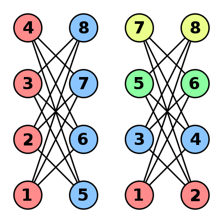

# Bath Challenge

Welcome to the OpenQAOA challenge!

Our challenge is to solve the [Graph Colouring problem](https://en.wikipedia.org/wiki/Graph_coloring), one of the famous NP-complete problems, with a quantum computer.

As far as we know, it is not possible to solve a NP-Complete problem in polynomial time. However, one way to tackle NP problems is to employ heuristics. The **quantum approximate optimization algorithm (QAOA)** is one such heuristic algorithm, and it can be used to solve (small!) binary optimization problems. What interests us today, is that QAOA is an algorithm that can be run on existing quantum computers! 

!!! info "For the curious"
    The original QAOA paper can be found on the arxiv ([Farhi, Edward, Jeffrey Goldstone, and Sam Gutmann. "A quantum approximate optimization algorithm](https://arxiv.org/abs/1411.4028)). The paper is a bit technical, and may not be the best reference for a 12h challenge. So, if you need a more lay-down intro, please check out the OpenQAOA [what-is-the-qaoa](/docs/what-is-the-qaoa.md) reference.


## **How to approach the challenge**
Quantum computations are not easy. So, we broke the challenge into a series of sequential steps. 

You don't need to strictly follow the steps as we have outlined them. The most important things are:

 - A correct implementation of the graph coloring problem
 - Your exploration of the problem space!

The last section includes some ideas on how to further explore the challenge.


###  **STEP 1. Find the cost function**

First things first: what are we trying to do? We are given a graph with $N$ vertexes and some connectivity, and a set of $k$ colors. The optimization problem then is to **find a color for each vertex such that no edge connects two vertexes of same color.** Two simple examples are given by the following choices of graphs and coloring: 




Now that we have an idea of the problem that we are trying to solve, we need to encode the graph colouring problem as a cost function $f(\vec y)$, a function to minimize. The input of this function could be a vector $\vec y = (y_1, y_2, ..., y_N)$, where $y_i \in \{0, 1, ..., k-1\}$ indicates the color of the $i$ node. Then the solution of the problem could be expressed as:

$$ \vec y^*=\underset{\vec y}{\arg \min } f(\vec y),$$

However, we want to solve the problem on a quantum computer, where the qubits only have two positions: $\uparrow$ and $\downarrow$. This requires you to write the cost function in terms of **binary variables**, $\vec x = (x_1, ..., x_n)$ where $x_i \in \{0,1\}$ and $n$ is the number of qubits that you will use. 

A good place to familiarize yourself with these type of cost functions is the great paper [Ising formulations of many NP problems](https://arxiv.org/abs/1302.5843) by Andrew Lucas. In section $6.1$ he introduces graph colouring problems, and it offers the following cost function:

$$ f(\vec x) = 
A \sum_v^N(1 - \sum_{i=1}^{k} x_{v,i})^2 + A \sum_{(uv) \in E} \sum_{i=1}^{k} x_{u,i}x_{v,i}
$$

Here the indices $u, v$ indicate the label of the graph node, $i$ indicates the color and $E$ the edges of the graph that we want to color. 

!!! info "Think"
    Spend some time convincing yourself that the above cost function makes sense! What is the significance of the first term? And the second? How many **binary variables, n** would you need to encode a N-nodes graph given k-colours? How does the size of the problem scale?


Although this is the right cost function, it is not trivial to see the decomposition of the QAOA circuit from it. Instead, you should convert it to a QUBO problem:

$$ f(\vec x) = \sum_i^n \sum_j^n Q_{ij} x_ix_j,$$

where $Q$ is a matrix that encodes the whole problem. 

!!! info "For the curious"
    QUBO stands for quadratic unconstrained binary optimization. You can check out the [what-is-a-qubo](/docs/problems/what-is-a-qubo.md) to learn more about it and see some examples.

### **STEP 2. Solve the Graph coloring problem using OpenQAOA** 

Take a look at the OpenQAOA workflows to check how you can solve problems using QAOA. You can find them at [the-simplest-workflow](/docs/the-simplest-workflow.md) and [customise-the-QAOA-workflow](/docs/workflows/customise-the-QAOA-workflow.md). But as a quick recap, the easiest way to run QAOA is:

```Python
from openqaoa import QAOA

q = QAOA()
q.compile(qubo_problem)
q.optimize()
```

where `qubo_problem` is defined as:

```Python
from openqaoa.problems import QUBO

qubo_problem = QUBO(terms=[[..], [..], ...],
                    weights=[...],
                    n=number_of_vertexes)
```
where `terms` is a list of lists, and `weights` is a list of integers. As an example, if one has a QUBO problem encoded in a matrix like

$$ Q = 
\begin{bmatrix}
    Q_{00} & Q_{01} & Q_{02} \\
    Q_{10} & Q_{11} & Q_{12} \\
    Q_{20} & Q_{21} & Q_{22}
\end{bmatrix} = 
\begin{bmatrix}
    Q_{0} & Q_{01} & Q_{02} \\
    Q_{01} & Q_{1} & Q_{12} \\
    Q_{02} & Q_{12} & Q_{2}
\end{bmatrix},
$$

where the second equality holds because QUBO matrices are symmetric, then the QUBO object would be initialized as:
```Python
qubo_problem = QUBO(terms=  [[0,1], [0,2], [1,2], [0], [1], [2]],
                    weights= [Q_01,  Q_02,  Q_12, Q_0, Q_1, Q_2],
                    n=number_of_vertexes)
```

!!! info

    When initializing the QUBO object in OpenQAOA there is no need to include the terms that are weighted 0, and make sure that `len(terms) == len(weights)`.
 

#### **STEP 2.1. Code the QUBO problem**

Your job is to write a function that takes as an input a graph to be colored, and the number of colors and it returns a QUBO object:

```Python
def graph_coloring_qubo(graph, k) -> QUBO:
    # TODO
```

!!! hint
    If you are stuck, and you need some inspiration you can check how some of the other problem classes are structured in OpenQAOA by checking out the [OpenQAOA github page](https://github.com/entropicalabs/openqaoa/tree/main/src/openqaoa-core/problems). In particular, the method `get_qubo_problem()` has the same functionality that you are tackling here. 


#### **STEP 2.2. Run QAOA**

Now it's time to try to color some graphs running a QAOA on a quantum simulator. 

Let's start with only $k=3$ colors on a small graph such as:

 

Now convert this problem instance to a qubo using the `graph_coloring_qubo` function that you have implemented already by doing:

```Python
gc_qubo = graph_coloring_qubo(graph, k)
```
and simply compile the QAOA object with this qubo. As simple as this:
```Python
q = QAOA()
q.compile(gc_qubo)
q.optimize()
```
When you compile the object, OpenQAOA translates the QUBO to an ising Hamiltonian and compose the QAOA circuit. After that, when you optimize the algorithm tries to find the optimal parameters. This means that you have colored your first graph! Congratulations! To check the solutions you can do:
```Python
q.results.most_probable_states
```

<br>
You can try to color other more complicated graphs, some examples could be:

 
 

!!! warning "QAOA is an heuristic"

    You may find solutions that are not optimal. This can happen because QAOA is an approximation and quantum computers are noisy. We recommend you to solve the problem classically to see the optimal solutions that we are trying to find with QAOA. You can do that with OpenQAOA: 

        ground_state_hamiltonian(qubo.hamiltonian)


!!! danger "Try not to crash your laptop!"
    Remember that to simulate a quantum computer you need $2^{n}$ variables, where $n$ is the number of qubits. In our case this means that given $n$ colors and $N$ vertexes you will need $2^{nN}$ numbers. Typically each number is represented by 128bits. You can try to plot $128 * 2^{nN}$ to see how quickly you will run out RAM! 

### **STEP 3. Interpret the result**

So, you ran a QAOA workflow successfully ... what next? Well, you can start studying the `q.results` object. First, read the [making-sense-of-the-result](/docs/making-sense-of-the-result.md) page. 

The result will look at so
```Python
> results
{'solutions_bitstrings': ['010110'], 'bitstring_energy': -4.0}
```

This represents the most probable quantum state identified by the QAOA. In order to figure out how to interpret this result, you need to go back to the cost function. You need to make sure you know how to map each binary variable within the bistring back to the binary variable $x_{v,i}$!


### **OPTIONAL. Study the QAOA parameters**

Our goal is to achieve the lowest cost value. How does the lowest cost change as we vary certain QAOA Parameters? 

What happens when you vary the number of layers $p$? And as you increase the number of vertexes? What can you tell about the size of the graph? And is there anything special when it comes to the initialization parameters? 

You can easily test many of these parameters through OpenQAOA workflow setters:

```Python
q = QAOA()
q.set_circuit_properties(p=3, param_type='fourier', q=2)
```

Can you find a combination of QAOA Parameters that gives you the best result for any random graph?

### **OPTIONAL. Study the Graph and the Solution**

Andrew Lukas paper says that given `k` colors and `N` vertexes it takes `nN` qubits to encode the problem. Without saturating your RAM, do you think you can play around with different graph topologies and colouring schemes?

Maybe try to plot a scaling of the performance of the algorithm as a function of changing graph properties (e.g. edge connectivity).

### **Extras** 

In the eventuality that you have had the time to explore QAOA and the graph colouring problem, here are a few ideas to keep you entertained:

- Try to solve the problem using a Quantum Computer! We suggest you use the free IBM ones, see the [ibmq](/docs/devices/ibmq.md) page
- Can you come up with some interesting parameter initialization strategies?
- Have a look at [RQAOA](/docs/workflows/recursive-qaoa.md): how does it perform with respect to plain QAOA?
 
