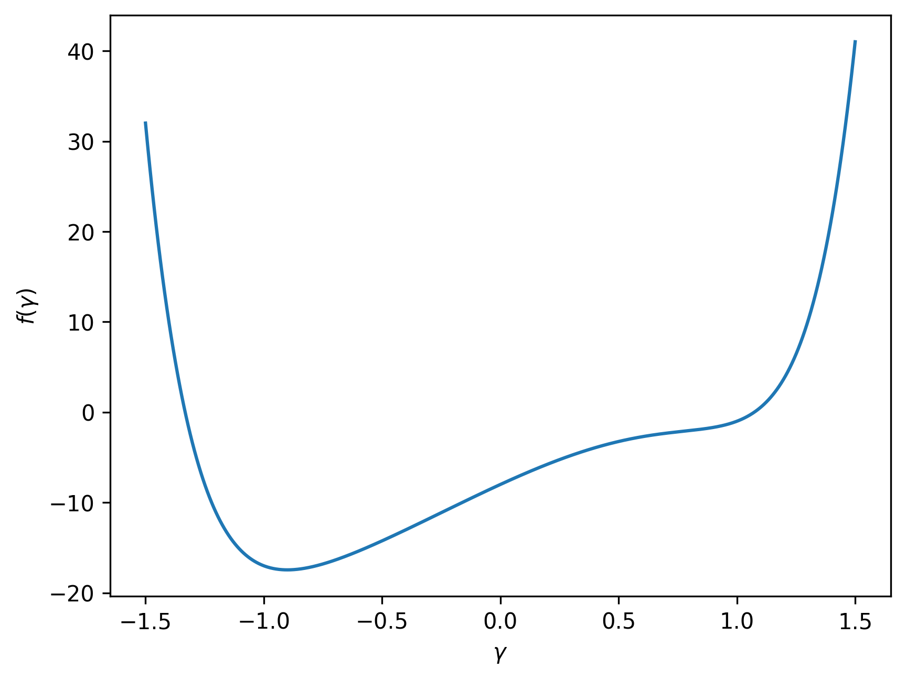
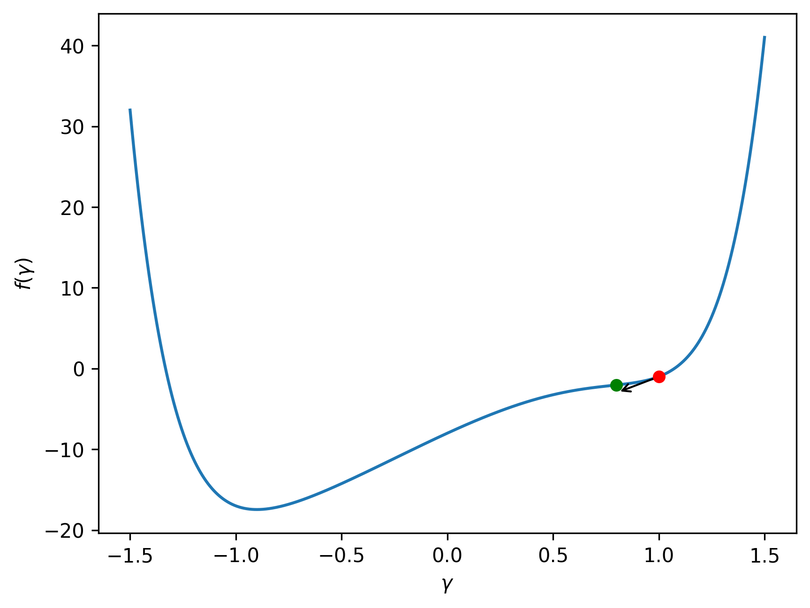
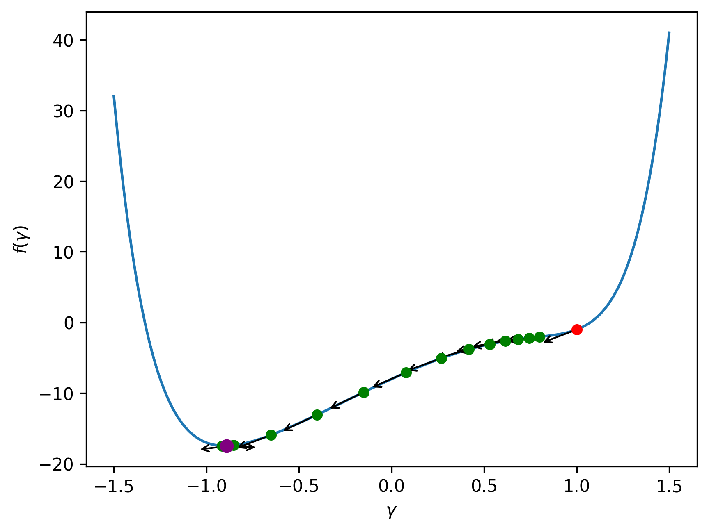

Quantum Approximate Optimization Algorithm (QAOA) is a quantum algorithm used to find approximate solutions to combinatorial optimization problems. By combining the computational power of a quantum computer and a classical computer, QAOA is able to search for minimums of a cost function, which represents the optimization problem at hand. The optimization of the parameters of the QAOA algorithm is a crucial component of the algorithm and plays a significant role in determining its performance. The optimization is performed on the classical computer using an optimization algorithm. For more information on QAOA, you can visit the [What is the QAOA?](/docs/what-is-the-qaoa.md) page.

## What is an optimization algorithm

Optimization algorithms are a fundamental part of machine learning, but they also have a crucial role in the Quantum Approximate Optimization Algorithm (QAOA). These algorithms are used to find the set of parameters that minimize a cost function. The goal of the optimization algorithm is to find the set of parameters that result in the minimum value of the cost function that represents the problem being solved. 

An optimization algorithm works by iteratively updating the parameters in order to reduce the value of the cost function. The algorithm starts with an initial set of parameters and updates them based on the gradient of the cost function with respect to the parameters. The gradient indicates the direction of the steepest increase in the cost function, and the algorithm uses this information to move in the opposite direction, towards a minimum. This process is repeated until the cost function reaches a minimum value or until a predetermined stopping criterion is met. Popular gradient-based optimization algorithms include Gradient Descent, Stochastic Gradient Descent, Adagrad, RProp, Adam, etc.

It's important to note that not all optimization algorithms use gradients to find the minimum of a cost function. Gradient-free optimization algorithms, as the name suggests, do not use gradients to update the parameters. Instead, they rely on other techniques. Examples of gradient-free optimization algorithms include: Cobyla, Nelder-Mead, Powell, etc.

## Example of an optimization

Consider a cost function that depends on a single parameter, $\gamma$, given by the equation:

$$f(\gamma)=2\gamma^8-4\gamma^3 - 3\gamma^2 + 12\gamma -8$$

The shape of this cost function can be visualized as follows:



Suppose we start with an initial value of $\gamma^{(1)}=1$. The first iteration of the optimization process would then proceed as follows:

1. The starting point is established at $(1, f(1))$, represented by the red dot.
2. The gradient of the cost function at $\gamma^{(1)}=1$ is calculated, $f'(1)=2.92$. Which is depicted as a black arrow.
3.  The new parameter is calculated as $\gamma^{(2)}=\gamma^{(1)}-\alpha\cdot f'(\gamma^{(1)})=0.74$, where the step size $\alpha$ used is 0.02. The updated point is $(0.74, f(0.74))$, represented by the green dot.

This iteration is visualized as follows:



The entire optimization process is depicted below:



The final optimized value of $\gamma$ is $\gamma^{(\text{opt})}=-0.89$, represented by the purple dot.


## Optimizers in OpenQAOA

As previously noted, the QAOA parameters are optimized through the use of a classical computer and a quantum computer. The quantum computer evaluates the cost function, while the classical computer updates the parameters. The cost function of QAOA is $f(\vec\gamma, \vec\beta) = \langle \psi(\vec\gamma, \vec\beta)|\mathcal{H}_C|\psi(\vec\gamma, \vec\beta)\rangle$, where $\vec\gamma$ and $\vec\beta$ are the parameters sets, which have to be optimized. 

OpenQAOA provides the ability to choose the optimization algorithm to be used and to configure its parameters. An example of how to set the optimizer in OpenQAOA is shown below:

```Python hl_lines="6 7"
from openqaoa import QAOA 

# create the QAOA object
q = QAOA()

# set optimizer and properties
q.set_classical_optimizer(maxiter=100, method='cobyla')

# compile and optimize using the chosen optimizer
q.compile(problem)
q.optimize()
```
In this example, the optimizer used is COBYLA, which is a gradient-free optimization algorithm with a maximum number of iterations set to 100. The following is a comprehensive list of all optimization algorithms available in OpenQAOA:

- <a style="color:inherit; font-weight:bold" href="/optimizers/gradient-free-optimizers">Gradient-free optimizers</a>: `nelder-mead`, `powell`, `cg`, `bfgs`, `newton-cg`, `l-bfgs-b`, `tnc`, `cobyla`, `slsqp`, `trust-constr`, `dogleg`, `trust-ncg`, `trust-exact`, and `trust-krylov`.
- <a style="color:inherit; font-weight:bold" href="/optimizers/gradient-based-optimizers">Gradient-based optimizers</a>: `vgd`, `newton`, `rmsprop`, `natural_grad_descent`, and `spsa`.

In addition to these, some optimizers from the PennyLane library have been adapted for use in OpenQAOA. These include:

- <a style="color:inherit; font-weight:bold" href="/optimizers/pennylane-optimizers">PennyLane optimizers</a>: `pennylane_adagrad`, `pennylane_adam`, `pennylane_vgd`, `pennylane_momentum`, `pennylane_nesterov_momentum`, `pennylane_rmsprop`, `pennylane_rotosolve`, and `pennylane_spsa`.

OpenQAOA also includes a group of gradient-based optimizers that have not been listed, as these optimizers have been specifically designed for use in quantum algorithms. These are referred to as shot adaptive optimizers and modify the number of shots used to evaluate the gradient at each iteration. The available shot adaptive optimizers in OpenQAOA are:

- <a style="color:inherit; font-weight:bold" href="/optimizers/shot-adaptive-optimizers">Shot adaptive optimizers</a>: `cans`, and `icans`.

To gain a deeper understanding of all the available optimizers in OpenQAOA and learn how to utilize them, please refer to the sections dedicated to [Gradient-based](/optimizers/gradient-based-optimizers), [Gradient-free](/optimizers/gradient-free-optimizers), [PennyLane](/optimizers/pennylane-optimizers), and [Shot adaptive](/optimizers/shot-adaptive-optimizers) optimizers. 


