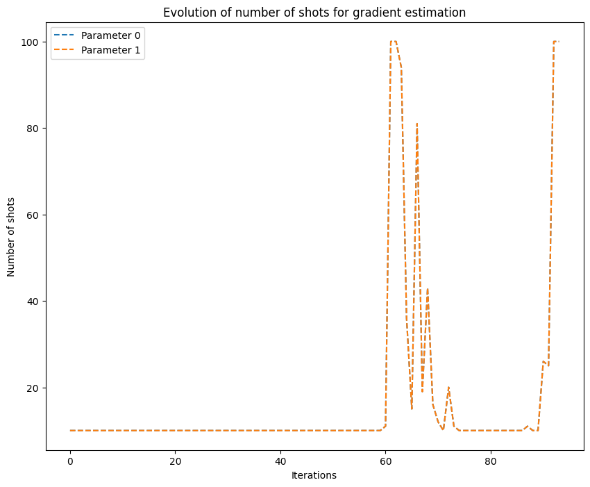

# Shot-adaptive optimizers

There is a type of optimizers that we call Shot-adaptive optimizers. These are a variant of gradient-based optimizers that use properties of quantum computers to improve the optimization process. Specifically, they take advantage of the fact that to evaluate the cost function in a quantum computer, you need to repeat the evaluation of the circuit multiple times. This is because a quantum computer works on the principle of superposition, the amplitudes of the output quantum state cannot be accessed directly but one needs to perform multiple circuit application followed by measurements of the output quantum state to obtain the probabilities of each base state. The number of evaluations needed are called "shots". 

Let us redefine the cost function as:

$$ f_N(\vec\gamma), $$

where $\vec\gamma$ is the set of parameters to be optimized and $N$ is the number of shots used in the cost function computation.

At each iteration, Shot-adaptive optimizers update the parameters by computing the gradient approximation using a varying number of shots. The number of shots used for each gradient approximation is decided by applying some specific strategy.

In OpenQAOA two different shot-adaptive optimizers are implemented: CANS and iCANS. Both are based on the gradient descent optimizer and use similar strategies to vary the number of shots. We can write the parameters update rule as:

$$ \vec\gamma^{(k+1)} = \vec\gamma^{(k)} - \alpha \, \vec g(\vec \gamma^{(k)}) $$

where $\vec g$ is the gradient approximation of the cost function. CANS and iCANS have been designed such that are more efficient using the parameter-shift rule to compute the gradient. For the plain gradient descent, using the parameter-shift rule, we would compute each component of the $\vec g(\vec \gamma^{(k)})$ as:

$$ g_i(\vec \gamma^{(k)}) = r \, \bigg[ f_N\left(\vec\gamma^{(k)} + \frac{\pi}{4r}\vec{e}_j\right) - f_N\left(\vec\gamma^{(k)} - \frac{\pi}{4r}\, \vec{e}_j\right) \bigg], $$

where $N$ is a fixed hyperparameter. However, for the shot-adaptive methods it would look like:

$$ g_i(\vec \gamma^{(k)}) = r \, \bigg[ f_{N_i^{(k)}}\left(\vec\gamma^{(k)} + \frac{\pi}{4r}\vec{e}_j\right) - f_{N_i^{(k)}}\left(\vec\gamma^{(k)} - \frac{\pi}{4r}\, \vec{e}_j\right) \bigg], $$

where ${N_i^{(k)}}$ is an integer that can change for each component at each iteration. Let us see the strategies that CANS and iCANS follow to compute ${N_i^{(k)}}$.


## Coupled Adaptive Number of Shots (CANS)

This optimizer uses the same number of shots for each gradient component, adjusting this number at each iteration, therefore we can write:

$$ N^{(k)}\equiv N_i^{(k)} .$$

And it is computed using the following rule:

$$ N^{(k)} =  \frac{2 \alpha L \,\xi^{(k)}}{(2-\alpha L)\cdot(||\vec\chi^{(k)}||^2+b\mu^k)},$$

where $L$ is the Lipschitz constant, $\alpha$ the step size, $b$ a small hyperparameter, $\mu$ a hyperparameter close to 1 that controls the memory of the following adaptive parameters, 

$$\vec\chi^{(k)}  = \mu \vec\chi^{(k-1)}  + (1-\mu)\,\,\vec g(\vec \gamma^{(k-1)} ), \quad \text{and} \quad  \xi^{(k)} = \mu \xi^{(k-1)} + (1-\mu)\sum_i v_i^{(k-1)}, $$

where $v_i^{(k)}$ is the variance of $g_i(\vec\gamma^{(k)})$. Also, $\vec\chi^{(0)}$ and $\xi^{(0)}$ are set to $\vec 0$ and $0$, respectively; and $N^{(0)}=n_{\text{min}}$, which is a hyperparameter. 

To ensure good performance, the value of $N^{(K)}$ is constrained as follows:

$$n_{\text{min}} \leq N^{(k)} \leq n_{\text{max}}, $$

where $n_{\text{max}}$ is also a hyperparameter. These bounds are imposed to ensure numerical stability and avoid over- or under-sampling of certain components.
 

!!! warning "Warning for both CANS and iCANS"

    Note that the number of shots $N_i^{(k)}$ for each gradient component must be an integer. One way to obtain an integer value for $N_i^{(k)}$ is to round the value obtained from the formula to the closest integer using a ceiling function.

!!! warning "Warning for both CANS and iCANS"

    To ensure convergence, the step size $\alpha$ should be chosen such that $\alpha < \frac{2}{L}$, and the hyperparameter $\mu$ should be chosen such that $0 < \mu < 1$.

    An upperbound of the Lipschitz constant can be computed as: $L < \sum_i |c_i|,$ where $c_i$ are the coefficients of the cost Hamiltonian. 

## individual Coupled Adaptive Number of Shots (iCANS)
iCANS is another optimizer that is based on the same idea as CANS, but it uses a different number of shots for each gradient component. The number of shots for each component is updated at each iteration, based on the variance of the gradient estimate of that component.

The number of shots for the $i\text{-th}$ component at iteration $k$ is denoted by $N_i^{(k)}$, and is computed as follows:

$$ N^{(k)}_i =  \frac{2 \alpha L \,\xi^{(k)}_i} {(2-\alpha L)\cdot\left({(\chi^{(k)}_i)}^2+b\mu^k\right)},$$

where $L$ is the Lipschitz constant, $\alpha$ the step size, $b$ a small hyperparameter, $\mu$ a hyperparameter close to 1 that controls the memory of the following adaptive parameters, 

$$\chi^{(k)}_i  = \frac{\mu \chi^{(k-1)}_i + (1-\mu) \,\,g_i(\vec \gamma^{(k-1)} )}{1-\mu^{k+1}}, \quad \text{and} \quad  \xi^{(k)}_i = \frac{\mu \xi^{(k-1)}_i + (1-\mu)\,\,v_i^{(k-1)}}{1-\mu^{k+1}}, $$

where $v_i^{(k)}$ is the variance of $g_i(\vec\gamma^{(k)})$. Also, $\vec\chi^{(0)}$ and $\xi^{(0)}$ are set to $\vec 0$ and $0$, respectively; and $N^{(0)}=n_{\text{min}}$, which is a hyperparameter.


Similar to CANS, iCANS also has a lower and upper bound on the number of shots for each component:

$$n_{\text{min}} \leq N^{(k)}_i \leq n_{\text{max}}, $$

## OpenQAOA example

In the following example it can be seen how to run QAOA using a shot-adaptive optimizer using OpenQAOA.

```Python hl_lines="6-19"
from openqaoa import QAOA 

# create the QAOA object
q = QAOA()

# set optimizer and properties
q.set_classical_optimizer(
    method='cans', 
    jac="param_shift", 
    maxiter=100,
    optimizer_options=dict(
        stepsize=0.001,
        mu=0.95,
        b=0.001,        
        n_shots_min=10,
        n_shots_max=100,
        n_shots_budget=50000,
    )
)

# compile and optimize using the chosen optimizer
q.compile(problem)
q.optimize()
```
Here, we set the method argument to `cans`, the Jacobian approximation method to the parameter-shift rule, then we set the maximum number of iterations to 100 and we customize the optimizer using the optimizer_options argument. In this case, we set $\alpha$ to $0.5$, $\mu$ to $0.95$, $b$ to $0.001$, $n_{\text{min}}$ to 10, and $n_{\text{min}}$ to 100. We can also see that we have set a budget of shots, this means that if the optimization reaches this total of shots number of it stops. 

If after this code we run the following line:
```Python 
q.results.plot_n_shots()
```
We get the graph below, where it can be seen that at each iteration a different number of shots is used for the gradient approximation of all the parameters:




!!! warning 

    When using CANS and iCANS optimizers, one has to keep in mind that they are optimized to be efficient when using the parameter-shift rule to compute the gradient. Therefore, it is important to specify this method when computing the Jacobian to ensure the optimizers perform as expected.

References
----------
1. Jonas M. Kübler, Andrew Arrasmith, Lukasz Cincio, and Patrick J. Coles (2020). An Adaptive Optimizer for Measurement-Frugal Variational Algorithms, [https://arxiv.org/abs/1909.09083](https://arxiv.org/abs/1909.09083).

