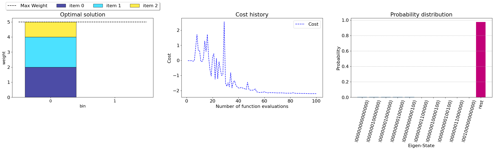
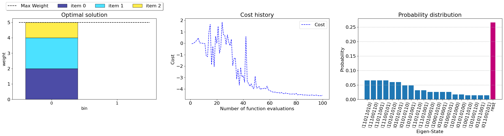

# The Bin Packing Problem

The Bin Packing Problem (BPP) involves the efficient packing of a collection of items into the minimum number of bins, where each item has an associated weight and the bins have a maximum weight capacity. This problem finds applications in various real-world scenarios, including truck loading with weight restrictions, container scheduling, FPGA chip design among others. The BPP is classified as an NP-hard problem due to its computational complexity. The problem can be formulated as follows, minimize the total number of bins used given by the objective function,

$$\begin{equation}
\min \sum_{j=0}^{m-1} y_j\tag{1},
\end{equation}$$

subject to the following constraints. Each bin's weight capacity should not be exceeded

$$\begin{equation}
\sum_{i=0}^{n-1} w_i x_{ij} \le B y_j \quad \forall j=0,...,m-1\tag{2},
\end{equation}$$

and each item can only be assigned to one bin

$$\begin{equation}
\sum_{j=0}^{m-1} x_{ij} = 1 \quad \forall i = 0, ..., n-1.\tag{3}
\end{equation}$$

Binary variables indicating item-bin assignments and bin utilization

$$\begin{equation}
x_{ij} \in {0,1} \quad \forall i=0,..,n-1 \quad \forall j=0,..,m-1,\tag{4}
\end{equation}$$

$$\begin{equation}
y_j \in {0,1} \quad \forall j=0,..,m-1\tag{6}
\end{equation}$$

In the above equations, $n$ represents the number of items (nodes), $m$ represents the number of bins, $w_{i}$ is the weight of the $i$-th item, $B$ denotes the maximum weight capacity of each bin, and $x_{ij}$ and $y_j$ are binary variables representing the presence of item $i$ in bin $j$ and the utilization of bin $j$, respectively. The objective function in Eq.(1) aims to minimize the number of bins used, while Eq.(2) enforces the constraint on bin weight capacity. Eq.(3) ensures that each item is assigned to only one bin, and Eqs.(4) and (5) define the binary nature of variables $x_{ij}$ and $y_j$.

## Solving the problem using QAOA
To encode the problem and solve it, we can use the [openqaoa library](https://openqaoa.entropicalabs.com/), a SDK with functionalities to convert combinatorial optimization problems into QAOA sequences.


```python
from openqaoa.problems import BinPacking
from openqaoa.problems import FromDocplex2IsingModel
from openqaoa import QAOA, QUBO
import numpy as np
import matplotlib.pyplot as plt

font_size = 16
plt.rcParams['font.size'] = font_size

%matplotlib inline
```


```python
def qaoa_result(qubo, p=5, maxiter=100):
    """
    qubo (openqaoa.QUBO): Ising Hamiltonian of the problem
    p (int): Number of layers of the QAOA circuit
    maxiter (int): Maximum number of iterations
    """
    max_weight = np.max(qubo.weights)
    qubo_weights = [w/max_weight for w in qubo.weights]
    qubo_normal = QUBO(qubo.n, qubo.terms, qubo_weights) # Normalizing the QUBO weights, (it can help sometimes to improve the results)

    qaoa = QAOA()
    qaoa.set_circuit_properties(p=p, init_type="ramp", linear_ramp_time=0.1) # initialization betas and gammas with a ramp technique
    qaoa.set_classical_optimizer(maxiter=maxiter) 
    qaoa.compile(qubo_normal)
    qaoa.optimize()
    return qaoa
```

## Setting the problem


```python
np.random.seed(1234)
#setting the problem
n_items = 3 # number of items
n_bins = 2 # maximum number of bins the solution will be explored on 
min_weight = 1 # minimum weight of the items
max_weight = 3 # maximum weight of the items
weight_capacity = 5 # weight capacity of the bins
weights = np.random.randint(min_weight, max_weight, n_items) # random instance of the problem
```

## Classical solution and visualizaiton using CPLEX
This solution is based on the python based library of `CPLEX`, [docplex](https://pypi.org/project/docplex/).


```python
bpp = BinPacking(weights, weight_capacity, n_bins=n_bins, simplifications=False) #setting the problem using a openqaoa class
sol_cplex = bpp.classical_solution(string=True) # getting the optimal solution using DocPLEX 
fig, ax = plt.subplots()
bpp.plot_solution(sol_cplex, ax)# Plotting the optimal solution
```


    

    


## 1. Solving a random problem using slack variables encoding


```python
penalty = [10, 10] # [Equality, Inequality] constraints
bpp_slack = BinPacking(weights, weight_capacity, n_bins=n_bins, penalty=penalty, simplifications=False, method="slack")
qubo = bpp_slack.qubo # Ising Hamiltonian of the BPP using the slack variables encoding 
results_slack = qaoa_result(qubo, p=5, maxiter=100)
```

### 1.2 Quantum Solution - QAOA


```python
nstates = 10
results = results_slack.result.lowest_cost_bitstrings(nstates)
idx_opt = 0
p = 0
for n in range(nstates): # There are multiple optimal solutions, 
    # Let's check which states share the same enegry with the ground state
    if results["bitstrings_energies"][n] == results["bitstrings_energies"][idx_opt]:
        p += results["probabilities"][n]
print(f"The probability of finding the optimal solution using the slack approach is: {round(100*p,1)}%")
```

    The probability of finding the optimal solution using the slack approach is: 0.2%


```python
fig, ax = plt.subplots(1,3, figsize=(30,5))
bpp_slack.plot_solution(results["solutions_bitstrings"][0], ax=ax[0])
results_slack.result.plot_cost(ax=ax[1])
results_slack.result.plot_probabilities(n_states_to_keep=nstates, ax=ax[2])
t = ax[0].set_title("Optimal solution")
```

    states kept: 10


    

    


## 2. Solving the random instance using unbalanced penalization

For the penalty terms, we can use the tuned parameters presented in the original [unbalanced penalization paper](https://arxiv.org/abs/2211.13914)


```python
penalty = [10, 2, 1] # [Equality, Inequality] constraints got from the unbalanced penalization paper
bpp_unbalanced = BinPacking(weights, weight_capacity, n_bins=n_bins, penalty=penalty, simplifications=False, method="unbalanced")
qubo = bpp_unbalanced.qubo # Ising Hamiltonian of the BPP using the slack variables encoding 
results_unbalanced = qaoa_result(qubo, p=5, maxiter=100)
```

### 2.2 Quantum Solution - QAOA


```python
nstates = 20
results = results_unbalanced.result.lowest_cost_bitstrings(nstates)
indx_opt = results["solutions_bitstrings"].index(sol_cplex)
p = 0
for n in range(nstates): # There are multiple optimal solutions, 
    # Let's check which states share the same enegry with the ground state
    if results["bitstrings_energies"][n] == results["bitstrings_energies"][0]:
        p += results["probabilities"][n]
print(f"The probability of finding the optimal solution using unbalanced penalization is: {round(100*p,1)}%")
```

    The probability of finding the optimal solution using unbalanced penalization is: 12.0%


```python
fig, ax = plt.subplots(1,3, figsize=(30,5))
bpp_unbalanced.plot_solution(results["solutions_bitstrings"][0], ax=ax[0])
results_unbalanced.result.plot_cost(ax=ax[1])
results_unbalanced.result.plot_probabilities(n_states_to_keep=nstates, ax=ax[2])
title=ax[0].set_title("Optimal solution")
```

    states kept: 20


    

    


# Conclusion 

In this notebook, we tested the BPP using `openqaoa` for a three items problem with QAOA $p=5$. The results are presented for the unbalanced penalization and slack encodings. The unbalanced penalization reduces the number of qubit needed to represent the problems and therefore improves considerably the probability of obtaining the optimal solution compared to the slack variables approach. 
