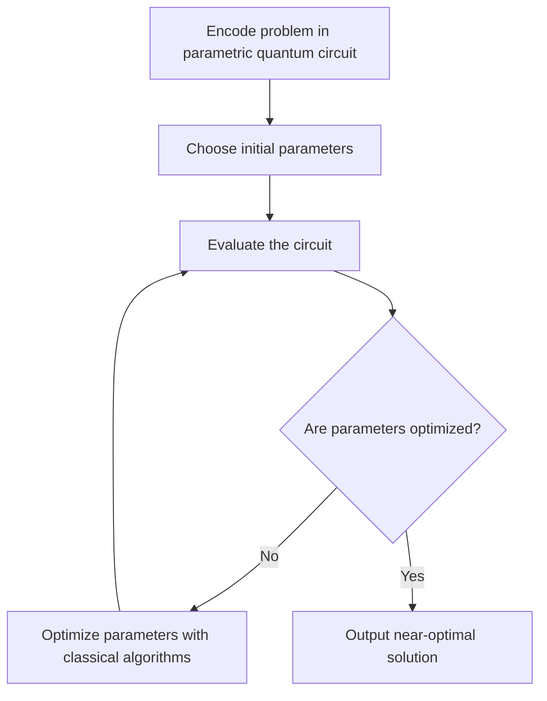

# What is the QAOA

Quantum computing has the potential to revolutionize the way we solve complex problems, and the Quantum Approximate Optimization Algorithm (QAOA) is one such algorithm that has been gaining attention in recent years. QAOA is a hybrid quantum-classical algorithm that combines quantum circuits and classical optimization to find approximate solutions to combinatorial optimization problems.

Combinatorial optimization is the process of finding the best solution from a finite set of possible solutions, and it plays a crucial role in fields such as machine learning, finance, and logistics. QAOA provides a new and innovative approach to solving these problems, using quantum computers to explore the solution space more effectively.

## Description of the algorithm

The algorithm consists of two main components: a parametric quantum circuit and classical optimization.

The parametric quantum circuit consists of gates that encode the problem to be solved, and these gates are determined by parameters that need to be optimized. The evaluation of the circuit yields the most probable state, which serves as a potential solution to the optimization problem.

The classical optimization component of the algorithm involves using classical algorithms to optimize the parameters of the quantum gates. This optimization process is performed iteratively, where each iteration involves reapplying the quantum gates to the quantum state using the latest set of optimized parameters, until a near-optimal solution is found.

## The quantum circuit

The starting state of the quantum circuit is $|0\rangle^{\otimes n}$, where $n$ is the number of qubits being used. The state after the circuit is applied is given by:

$$|\psi\rangle \equiv |\psi(\vec\gamma,\vec\beta)\rangle \equiv \mathcal{U}(\vec\gamma,\vec\beta)\,|0\rangle^{\otimes n},$$

where ${\vec\gamma}={\gamma_1, \gamma_2, ..., \gamma_p}$ and ${\vec\beta}={\beta_1, \beta_2, ..., \beta_p}$ are two sets of $p$ parameters.

The circuit of the QAOA algorithm is defined as follows:

$$\mathcal{U} (\vec\gamma,\vec\beta) = U(\mathcal{H}_X,\beta_p)U(\mathcal{H}_C,\gamma_p) ... U(\mathcal{H}_X,\beta_1)U(\mathcal{H}_C,\gamma_1) \, H^{\otimes n} ,$$

where $H$  is a Hadamard gate, $U(\mathcal{H}_X,\beta_j) = e^{-i\beta_j \mathcal{H}_X}$ and $U(\mathcal{H}_C,\gamma_j) = e^{-i\gamma_j \mathcal{H}_C}$.

$\mathcal{H}_C$ is the cost Hamiltonian, which encodes the problem to be solved, and $\mathcal{H}_X$ is the mixing Hamiltonian:

$$\mathcal{H}_X = \sum_{i=1}^n \sigma_{i}^x, $$

where $\sigma_{i}^x$ is the Pauli X matrix applied to the $i$ qubit.

The goal of the QAOA algorithm is to find the optimal sets of angles ${\vec\gamma^{\text{opt}}}$ and ${\vec\beta^{\text{opt}}}$ that minimize $\langle\psi|\mathcal{H}_C|\psi\rangle$. With the optimal parameters, $|\psi(\vec\gamma^{\text{opt}},\vec\beta^{\text{opt}})\rangle$ is a superposition of base states, and the state with the highest probability will be the solution to the problem.

The optimization of the parameters is carried out iteratively using a classical optimization algorithm such as cobyla or gradient descent.

For $p\to \infty$, it has been proven that a set of optimal parameters exist such that the solution is exact. However, for smaller values of $p$, the solution is only an approximation.

## Encoding of the problem

The encoding of the problem is a crucial step in the QAOA algorithm, as it determines the form of the parametric quantum circuit. This encoding is done by representing the problem as a cost Hamiltonian, $\mathcal{H}_C$, which maps the problem's variables to qubits and defines the cost function as an operator that acts on these qubits. The cost Hamiltonian has a fixed structure and, given an underlying binary optimizations problem (see read more about QUBOs on the [what is a QUBO](problems/what-is-a-qubo.md) page).

Problems that can be tackled by QAOA include [Minimum Vertex Cover](problems/minimum-vertex-cover.md), [Maximum Cut](problems/maximum-cut.md), [Number Partition](problems/number-partition.md), etc. These problems can all be mapped into a QUBO (Quadratic Unconstrained Binary Optimization) problem.

A QUBO problem consist on finding a vector $x$ such that the function

$$ f(x) =  \sum_{i=1}^n h_{i} x_i + \sum_{i, j} J_{i j} x_i x_j $$

is minimized. 
Where $x$ is a vector of $n$ components ($x_i \in \pm 1$), and $J_{ij}$ and $h_i$ are constants. Each different problem will have different $J_{ij}$ and $h_i$ values.

The function can be enconded in a cost Hamiltonian the following way:

$$ \mathcal{H}_C = \sum_{i=1}^n h_i \sigma_i^z + \sum_{i,j} J_{i j} \sigma_i^z \sigma_j^z  $$

where $\sigma_i^z$ is the Pauli Z matrix applied to the $i$ qubit.

## Decomposition of the circuit 

As the terms of these Hamiltonians commute, we can write:

$$U(\mathcal{H}_X,\beta_j) = e^{-i\beta_j \mathcal{H}_X} = \prod_k^n e^{-i\beta_j \sigma_{k}^x}, $$

$$U(\mathcal{H}_C,\gamma_j) = e^{-i\gamma_j \mathcal{H}_C} = \prod_k^n\prod_l^k e^{-i\gamma_j Q_{kl} \sigma_{k}^z\sigma_{l}^z}\,\prod_k^n e^{-i\gamma_j C \sigma_{k}^z}.$$

We know that $e^{-i\alpha \sigma_{k}^x}$ is the RX gate of $2\alpha$ applied at the $k$ qubit, $e^{-i\alpha \sigma_{k}^z}$ is the RZ gate of $2\alpha$ applied at the $k$ qubit, and $e^{-i\alpha \sigma_{k}^z\sigma_{l}^z}$ is the RZZ gate of $2\alpha$ applied at the $k$ and $l$ qubits.

This means that we now know how to construct the QAOA circuit for any QUBO problem.

## Classical loop

The classical loop procedure in quantum computing involves the following steps:

1. Encoding the optimization problem into a parametric quantum circuit
2. InitializingInitializing the circuit parameters
3. Evaluating the cost function, which represents the energy of the system described by the quantum circuit, by measuring the expectation value of the cost Hamiltonian $\langle \psi|\mathcal{H}_C|\psi\rangle$.
4. Updating the circuit parameters using a classical optimization algorithm, such as gradient descent or COBYLA, to minimize the cost function and find the optimal solution to the optimization problem.

The goal of the QAOA is to find the set of parameters ($\vec\gamma^\text{opt}, \vec\beta^\text{opt}$) that result in the minimum value of the cost function ($\langle \psi^\text{opt} |\mathcal{H}_C|\psi^\text{opt}\rangle$), thereby finding the approximate solution to the optimization problem encoded in the quantum circuit. The classical loop procedure is repeated multiple times until convergence to the optimal solution is achieved.

## Output

The output of the QAOA algorithm can be obtained by measuring the probabilities of the base states of the final quantum state after evaluating the circuit using the optimized parameters, $|\psi^\text{opt}\rangle=|\psi(\vec\gamma^\text{opt}, \vec\beta^\text{opt})\rangle = \mathcal{U}(\vec\gamma^\text{opt},\vec\beta^\text{opt})\,|0\rangle^{\otimes n}$ . This will result in a histogram, such as the one shown in the image below.

In the histogram, we can observe that the states $x_1 = 00011$ and $x_2 = 11100$ have higher probabilities compared to the other states, indicating that these two are likely solutions to the problem being addressed.

## Example 

We want to solve a very easy example of number partition problem.

Number partition is defined as: having a set $S$ of $n$ numbers, we want to find two disjoint subsets $S_1$ and $S_2$ so that the difference between the sum of all numbers of each set is minimized. 

For example, the solution for $S=\{3,4,5\}$ is $S_1=\{3,4\}$ and $S_2=\{5\}$, since the difference between the sums is 2.

But let us imagine that we want to solve number partition for $S=\{3,4,5\}$ using the QAOA algorithm:

The cost Hamiltonian of this problem is:

$$\mathcal{H}_C = 3\cdot 4\, \sigma_{1}^z\sigma_{2}^z + 3\cdot 5\, \sigma_{1}^z\sigma_{3}^z + 4\cdot 5\, \sigma_{2}^z\sigma_{3}^z ,$$

If we take $p=1$ and $\gamma_1=1, \beta_1=1$, then the resulting QAOA circuit is:

$$\mathcal{U} (\gamma_1=1,\beta_1=1) = e^{-i\sigma_{1}^x}\,e^{-i\sigma_{2}^x}\,e^{-i\sigma_{3}^x}\,e^{-20i\sigma_{2}^z\sigma_{3}^z}\,e^{-15i\sigma_{1}^z\sigma_{3}^z}\,e^{-12i\sigma_{1}^z\sigma_{2}^z}H^{\otimes 3},$$

which is equivalent to:

After the optimization of $\gamma_1$ and $\beta_1$, we should find an histogram like:

