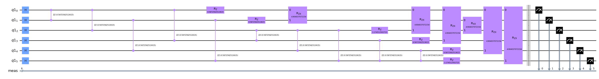

# Using Different Mixer Hamiltonians

One of the defining features of QAOA ansatz is the alternate application of the cost and mixer Hamiltonians. While the cost Hamiltonian tends to be defined by the problem at hand, the choice of mixer Hamiltonians is not as obvious. In OpenQAOA, we provide multiple utility functions that help create commonly used mixer Hamiltonians, such as the X and XY mixer Hamiltonians.

In this page, we provide the user with examples on how they can use these utility functions to quickly construct their mixer Hamiltonians. Furthermore, we will introduce a feature in OpenQAOA, inspired by Hadfield et. al in [From the Quantum Approximate Optimization Algorithm to a Quantum Alternating Operator Ansatz
](https://arxiv.org/abs/1709.03489), which allows the user to design their own custom mixer operators.

## Setting up the problem

For the examples in this notebook, we will be using the Minimum Vertex Cover problem. The problem statement goes as follows: Given a graph, identify the smallest subset of nodes such that all other nodes are connected to any node in that subset by at least 1 edge.

```Python
from openqaoa.utilities import plot_graph
import networkx as nx

nodes = 6
edge_probability = 0.7
g = nx.generators.fast_gnp_random_graph(n=nodes,p=edge_probability, seed=34)
plot_graph(g)
```

We can use `ground_state_hamiltonian()` from OpenQAOA utilities to obtain the exact solution to the problem

```Python
from openqaoa.problems import MinimumVertexCover
from openqaoa.utilities import plot_graph, ground_state_hamiltonian

# Brute Force Solution
mini_cov = MinimumVertexCover(g, field = 1., penalty = 1.)
mini_cov_qubo = mini_cov.qubo
energy, configuration = ground_state_hamiltonian(mini_cov_qubo.hamiltonian)
print('Energy: {}'.format(energy), '\nConfigurations: {}'.format(configuration))
```

Which gives

```Python
Energy: 4.0 
Configurations: ['011100', '011110', '101001', '011001', '111001', '011101', '100011', '101011', '100111']
```

## Solving the problem using QAOA

We will now solve the problem using QAOA. First, by using the built in `X` and `XY` mixers, introduce the concept of mixer connectivity, and finally show how you can build your own mixer operator.

### Using the x-mixer

In the standard QAOA, the X-mixer hamiltonian is used. Using the vectorized statevector simulator, we can solve the same problem as follows:

```Python
from openqaoa import QAOA

q = QAOA()
q.set_circuit_properties(mixer_hamiltonian = 'x')
q.compile(mini_cov_qubo)

q.optimize()
```

Which gives
```Python
q.result.most_probable_states
> {'solutions_bitstrings': ['101001'], 'bitstring_energy': 4.0}
```

### Using the xy-mixer and playing with connectivity 

OpenQAOA also provides an alternative to the X-mixer, the XY-mixer which utilizes 2-qubit interactions instead of the 1-qubit interactions used for the X-mixer hamiltonian.

```Python
from openqaoa import QAOA

q = QAOA()
q.set_circuit_properties(mixer_hamiltonian = 'xy', mixer_qubit_connectivity='full')
q.compile(mini_cov_qubo)

q.optimize()
```

Since the XY-mixer is made up of 2-qubit interactions, it is possible to change the connectivity of the mixer hamiltonian. By default, this value is "full". Which applies XX and YY interactions between every pair of qubit. Depending on the device connectivity, different choices are available. Currently, OpenQAOA supports `full', 'chain', 'star'` topologies.


### Quantum Alternating Operator Ansatz


The Quantum Alternating Operator Ansatz (QAOA) proposed by S. Hadfield et al. in [1] generalizes the alternating mixer and cost operator layers of the original QAOA by E. Farhi et al.

The algorithm involves the application of a phase separation operator (cost operator), defined by an objective function, and mixing operators that depend on the domain and structure of the objective function. This is a slight departure from the original QAOA algorithm where the mixer unitary is defined by Mixer Hamiltonians, the former allowing for more variations to the mixer unitary.

In the following examples, we show how one can define their own custom mixer blocks, a block containing gates that would be used to define the mixer unitary, using the OpenQAOA `GateMap` objects.

```Python
# Using manual mode, you can specify a custom mixer block using the GateMap Objects

from openqaoa.qaoa_components.ansatz_constructor import RZXGateMap, RXXGateMap
from openqaoa.qaoa_components import QAOADescriptor, create_qaoa_variational_params
from openqaoa.backends import create_device
from openqaoa.optimizers import get_optimizer
from openqaoa.backends.qaoa_backend import get_qaoa_backend

custom_mixer_block_gatemap = [RZXGateMap(0, 1), RZXGateMap(0, 2), 
                              RZXGateMap(0, 3), RZXGateMap(0, 4), 
                              RZXGateMap(0, 5), RXXGateMap(1, 2)]
custom_mixer_block_coeffs = [1., 1., 1., 1., 1., 1.]

qaoa_descriptor = QAOADescriptor(
    mini_cov_qubo.hamiltonian, 
    custom_mixer_block_gatemap,
    p=1, 
    mixer_coeffs=custom_mixer_block_coeffs)

device_local = create_device(
    location='local', 
    name='qiskit.shot_simulator')

variate_params = create_qaoa_variational_params(
    qaoa_descripto = qaoa_descriptor,
    params_type = 'standard',
    init_type = 'rand'
    )

backend_local = get_qaoa_backend(
    qaoa_descriptor = qaoa_descriptor, 
    device = device_local,
    n_shots = 2000
    )

optimizer = get_optimizer(
    vqa_object = backend_local,
    variational_params = variate_params, 
    optimizer_dict =  
    {
        'method': 'cobyla', 
        'maxiter': 100
    }
    )
```

Since we are using a qiskit device, we can also plot the circuit

```Python
backend_local.qaoa_circuit(variate_params).draw('mpl', scale=0.8, fold=-1)
```



We can then proceeded with optimization

```Python
optimizer.optimize()

optimizer.qaoa_result.most_probable_states
> {'solutions_bitstrings': ['100111'], 'bitstring_energy': 4.0}
```