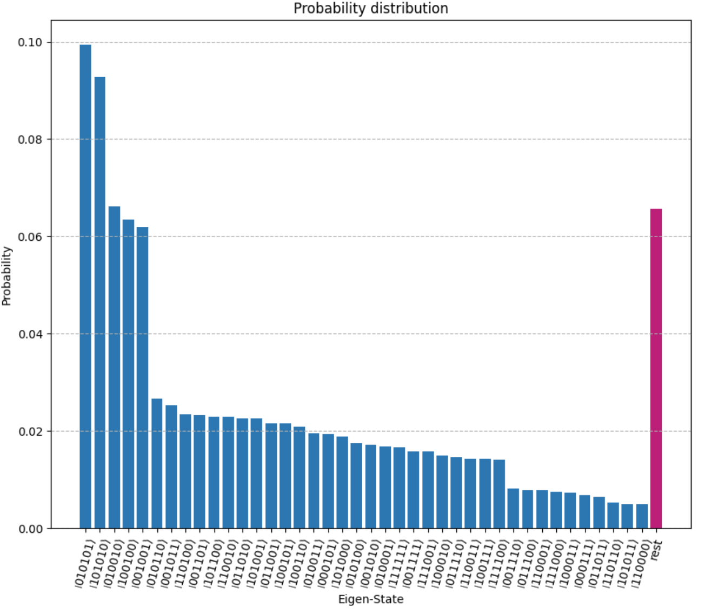

# Run a QAOA workflow on the cloud - QPUs

It is finally time to execute a QAOA computation on a real QPU!


## A simple example, connecting to the IBMQ Cloud QASM simulator

To begin, let's start by creating our usual benchmark problem: an instance of vertex cover:

```Python
import networkx
from openqaoa.problems import MinimumVertexCover

g = networkx.circulant_graph(6, [1])
vc = MinimumVertexCover(g, field=1.0, penalty=10)
qubo_problem = vc.qubo
```

Now that we have the qubo problem, let's focus on the cloud access. To connect to a QPU or to a cloud-based simulator, you will need to authenticate with the desired provider. You can check all the available backends go to the [devices page](../devices/device.md), but for our current example, let's focus on IBM.

First, you will need to have a correctly setup account with [IBMQ](https://quantum-computing.ibm.com/). Once your account has been created, all you need is your IBMQ token (available with the IBMQ landing page). The recommended way to use your token in OpenQAOA is the following

```Python
from qiskit import IBMQ

IBMQ.save_account('MY_API_TOKEN') 
```

Once we have authenticate we can proceeded with the OpenQAOA workflow


```Python
from openqaoa import QAOA, create_device
from qiskit import IBMQ

# Load account from disk
IBMQ.load_account() 

#Create the QAOA
q = QAOA()

# Create a device
ibmq_device = create_device(location='ibmq', name='ibm_oslo')
q.set_device(ibmq_device)

q.set_backend_properties(n_shots=8000)
q.set_classical_optimizer(method='cobyla', maxiter=50, tol=0.05)

q.compile(qubo_problem)
q.optimize()
```

There are three main changes compared to the previous examples
  - We use the `set_device()` method to select the correct device
  - We set the  `n_shots` to be executed on the quantum computer
  - We set bounds in terms of number of circuit executions by giving a maximum of `50` iterations, and a tolerance for subsequent cost values of 0.05


!!! tip
    The code above will result in up to 50 optimizer iterations, that is it will submit up to 50 jobs to the `ibmq_qasm_simulator` device! 


<!-- Now, let's look into the optimization result. First, we can check how many circuits were executed

```Python
q.result.evals

```

yields

```JSON
{'number_of_evals': 11, 'jac_evals': 0, 'qfim_evals': 0}
```

This means that we executed 16 circuits within our optimization loop! Indeed, we can retrieve the job ids associated to these execution by tying 

```Python
q.result.intermediate['job_id']
```

yields

```Python
['6427cf52b072ef0790b5dc25',
 '6427cf56417cad3f6b7f72a0',
 '6427cf5bb072ef0bf8b5dc26',
 '6427cf5f1181d8b3f0a5ad22',
 '6427cf63e6c3c92a8c8cb2e0',
 '6427cf67db7e34d609a98298',
 '6427cf6ce6c3c9dc038cb2e1',
 '6427cf71f2aaddc880a4a9f5',
 '6427cf7522b9b76d3f7845d1',
 '6427cf7a22b9b783547845d2',
 '6427cf7ff2aaddf142a4a9f6']
 ```

These jobs ID are the ones provided by IBM and can be used to retrieve the JSON dump as provided by IBM. We can also easily check the cost value, and confirm that our optimization ended when the tolerance threshold (remember? We set it as `tol=0.05` in the `set_backend_properties()`) was crossed

 ```Python
q.result.intermediate['cost']
```

yields

```Python
[15.720125,
 20.00975,
 19.1425,
 20.1755,
 19.37075,
 19.310375,
 33.233625,
 19.179,
 14.425375,
 20.4105,
 14.435125]
 ```


Finally, what about the optimal state? We can obtain all the pertinent information by executing
 
```Python
q.result.optimized
```

which yields

```JSON
{'angles': [-0.372908706525, 0.570235617839],
 'cost': 2.679125,
 'measurement_outcomes': {
  '100000': 2,
  '111010': 203,
  '100110': 24,
  '010110': 24,
  '110110': 242,
  '001110': 11,
  '101110': 195,
  '011110': 81,
  '111110': 587,
  '110101': 221,
  '001101': 24,
  '101101': 246,
  '011101': 204,
  '111101': 612,
  '101011': 212,
  '011011': 228,
  '111011': 612,
  '010111': 176,
  '110111': 603,
  '001111': 78,
  '101111': 554,
  '011111': 553,
  '111111': 1466,
  '111100': 71},
 'job_id': '6427c778b072ef3c75b5dbef',
 'eval_number': 14}
```

For convenience, we can plot the underlying probability distribution

 -->